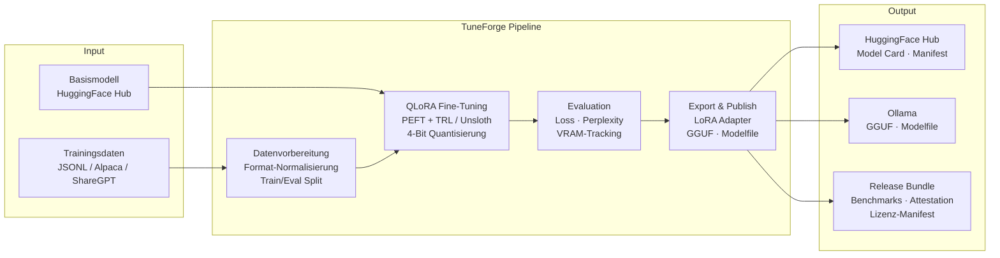
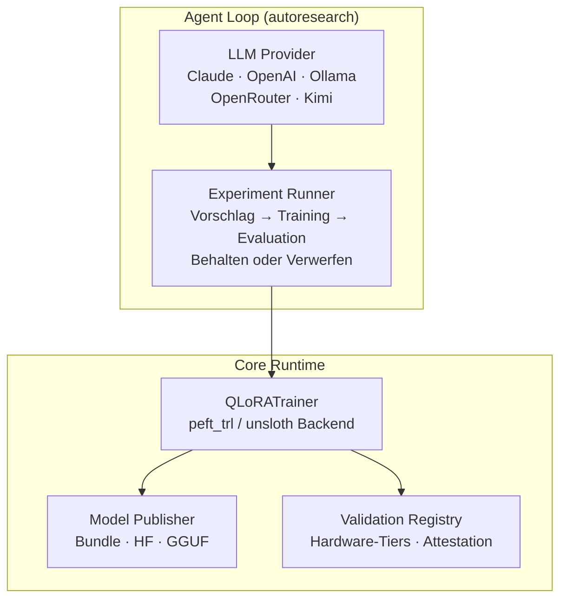

<div align="center">
  
</div>

<div align="center">

# TuneForge

**Benchmark-first Fine-Tuning-Framework fuer lokale LLMs auf eigener Hardware.**

[](LICENSE)
[](https://python.org)
[](Dockerfile.finetune)
[](docs/VALIDATION_MATRIX-DE.md)
[](COMPLIANCE_STATEMENT-DE.md)

[English version](README.md)

</div>

---

## Inhaltsverzeichnis

- [Ueberblick](#ueberblick)
- [Architektur](#architektur)
- [Features](#features)
- [Schnellstart](#schnellstart)
- [Konfiguration](#konfiguration)
- [Unterstuetzte Modelle und GPU-Tiers](#unterstuetzte-modelle-und-gpu-tiers)
- [Projektstruktur](#projektstruktur)
- [CI/CD](#cicd)
- [Compliance](#compliance)
- [Attribution](#attribution)
- [Contributing](#contributing)
- [Lizenz](#lizenz)

---

## Ueberblick

TuneForge ist ein Open-Source, auditfaehiges Engineering-Framework fuer QLoRA-Fine-Tuning, Benchmarking und kontrolliertes Model-Publishing. Aufgebaut auf [karpathy/autoresearch](https://github.com/karpathy/autoresearch), liefert es eine vollstaendige Pipeline von der Datenvorbereitung ueber Training und Evaluation bis zum Export nach Hugging Face und Ollama.

Entwickelt fuer Teams, die Modelle auf eigener Hardware betreiben — mit lueckenloser Provenance-Verfolgung, reproduzierbaren Benchmarks und EU-regulatorischem Bewusstsein von Anfang an.

> **Aktueller Status: Technical Preview.** Benchmark-Claims gelten nur fuer das dokumentierte Hardware-Budget. Dies ist keine Rechtsberatung und garantiert keine regulatorische Konformitaet.

## Architektur





## Features

- **Dual Backend** — Wechsel zwischen `transformers + peft + trl` und `unsloth` per Config. Gleiches Interface, gleiche Metriken.
- **Hardware-gestufte Configs** — Vorkonfigurierte Settings fuer 8 GB, 12 GB und 24 GB+ GPUs. Kein Raten noetig.
- **Autonomer Agent Loop** — Provider-agnostische Research-Schleife (Claude, OpenAI, Ollama, OpenRouter), die automatisch vorschlaegt, trainiert und evaluiert.
- **Kontrollierte Release Bundles** — Jeder Export enthaelt Model Card, Training-Manifest, Benchmark-Summary, Lizenz-Manifest, Environment-Snapshot und Tester-Attestation.
- **GGUF + Ollama Export** — Adapter zu GGUF konvertieren und Modelfiles fuer lokales Deployment generieren.
- **Audit Trail** — VRAM-Tracking, reproduzierbare Seeds, Git-SHA-Provenance, strukturiertes Logging.
- **Zweisprachige Dokumentation** — Vollstaendige EN/DE-Dokumentation, Governance-Templates und Compliance-Packs.

## Schnellstart

### Lokales Setup

```bash
git clone https://github.com/AI-Engineerings-at/tuneforge.git
cd tuneforge

python -m venv .venv
source .venv/bin/activate        # Linux/macOS
# .venv\Scripts\activate          # Windows

pip install --upgrade pip
pip install -e ".[llm,finetune,dev]"

# Tests ausfuehren
python -m pytest -q tests
```

### Docker (NVIDIA GPU erforderlich)

```bash
# Fine-Tuning Pipeline
AUTORESEARCH_DOMAIN=sps-plc docker compose -f docker-compose.finetune.yml up --build
```

### Fine-Tuning ausfuehren

```bash
# QLoRA-Training mit YAML-Config
python -m finetune.trainer --config finetune/configs/your-domain.yaml --eval

# Agent Loop (autonome Forschung)
python agent_loop.py --provider ollama --model qwen2.5-coder:7b
```

### Kanonisches Docker Image

```
ghcr.io/ai-engineerings-at/tuneforge-studio:<semver>
```

Images werden von GitHub Actions gebaut und publiziert. Nie ins Git committed.

## Konfiguration

### Umgebungsvariablen

| Variable | Beschreibung | Erforderlich |
|----------|-------------|--------------|
| `ANTHROPIC_API_KEY` | API-Key fuer Claude Provider | Fuer Claude Agent Loop |
| `OPENROUTER_API_KEY` | API-Key fuer OpenRouter | Fuer OpenRouter Agent Loop |
| `HF_TOKEN` | Hugging Face Access Token | Fuer Model Publishing |
| `AUTORESEARCH_DOMAIN` | Ziel-Domain fuer Training | Fuer Docker Pipeline |
| `NVIDIA_VISIBLE_DEVICES` | GPU-Device-Auswahl | Nur Docker |

### QLoRA Training Config (YAML)

| Parameter | Default | Beschreibung |
|-----------|---------|-------------|
| `base_model` | `Qwen/Qwen2.5-Coder-7B-Instruct` | HuggingFace Model-ID |
| `backend` | `peft_trl` | Training-Backend (`peft_trl` oder `unsloth`) |
| `dataset_format` | `alpaca` | Eingabeformat (`alpaca`, `sharegpt`, etc.) |
| `bits` | `4` | Quantisierungs-Bits (4-Bit QLoRA) |
| `lora_r` | `16` | LoRA-Rang |
| `lora_alpha` | `32` | LoRA-Alpha-Skalierung |
| `learning_rate` | `2e-4` | Lernrate |
| `max_steps` | `1000` | Maximale Trainingsschritte |
| `max_seq_length` | `2048` | Maximale Sequenzlaenge |
| `per_device_train_batch_size` | `4` | Batchgroesse pro GPU |
| `gradient_accumulation_steps` | `4` | Gradienten-Akkumulation |
| `primary_metric` | `eval_loss` | Zu optimierende Metrik |

## Unterstuetzte Modelle und GPU-Tiers

### GPU-Tier-Konfigurationen

| Tier | VRAM | Dataset | Modellgroesse | Seq Length | Batch Size | Einsatzzweck |
|------|------|---------|--------------|------------|------------|--------------|
| **Tier 1** | 6-8 GB | TinyStories | 384d / 3L | 256 | 16 | Schnelle Experimente, Validierung |
| **Tier 2** | 10-12 GB | ClimbMix | 512d / 5L | 512 | 32 | Mittelklasse-Training |
| **Tier 3** | 16-24 GB | ClimbMix | 768d / 8L | 2048 | 8 | Vollstaendige Trainingslaeufe |

### QLoRA-Basismodelle

| Modell | Parameter | Min VRAM (4-Bit) | Status |
|--------|-----------|-----------------|--------|
| Qwen2.5-Coder-7B-Instruct | 7B | ~8 GB | Standard |
| Jedes HuggingFace CausalLM | Variiert | Variiert | Unterstuetzt via Config |

### Hardware-Validierungs-Tiers

| Tier | Hardware | Status |
|------|----------|--------|
| Tier A | RTX 3090 (24 GB) | Validierungsziel |
| Tier B | A100 / H100 / 48 GB+ | Validierungsziel |
| Nicht zugewiesen | Andere GPUs | Technical Preview |

## Projektstruktur

```
tuneforge/
├── train.py                  # autoresearch Trainingsschleife
├── agent_loop.py             # Autonomer LLM-Agent fuer Forschung
├── agent_config.py           # Agent-Konfiguration
├── providers.py              # LLM-Provider-Abstraktion
├── finetune/
│   ├── trainer.py            # QLoRA Training Runtime
│   └── model_publisher.py    # Release Bundle & HF Publishing
├── datasets/
│   ├── data_formats.py       # Format-Normalisierung
│   └── synthetic_generator.py # Synthetische Datengenerierung
├── configs/                  # GPU-Tier-Konfigurationen (JSON)
├── validation/               # Validation Registry & Runbooks
├── scripts/                  # CI-Checks & Release-Validierung
├── docs/                     # Architektur, SOPs, Compliance
├── templates/                # Model Card & Governance Templates
├── docker-compose.finetune.yml
├── Dockerfile.finetune
└── pyproject.toml
```

## CI/CD

GitHub Actions Pipelines:

| Workflow | Zweck |
|----------|-------|
| `tuneforge-ci.yml` | Quality Gates, Repo-Hygiene, Dokumentations-Paritaetschecks |
| `tuneforge-release.yml` | Docker-Image-Build und Preview-Releases |
| `tuneforge-model-publish.yml` | Model-Bundle-Packaging und HuggingFace-Publishing |

Release-Automation haengt SBOMs, Checksummen, Validation-Registry-Snapshots und Release-Metadaten an. Secrets liegen nur in GitHub Secrets oder einem externen Vault — nie im Repository.

## Compliance

TuneForge ist mit EU-regulatorischem Bewusstsein entwickelt:

- **EU AI Act** — Die Dokumentationsstruktur unterstuetzt Artikel 11 (Technische Dokumentation) und Artikel 13 (Transparenz) fuer Engineering Review und Governance-Vorbereitung.
- **DSGVO** — Trainingsdaten-Provenance-Tracking, keine personenbezogenen Daten in Standard-Pipelines, Privacy Notes in Model Cards.
- **Audit-Readiness** — Strukturiertes Logging, reproduzierbare Trainingslaeufe, Hardware-Attestation und Validation Registry.

> Dies ist Engineering-Vorbereitung, keine Rechtszertifizierung. Fuer Compliance-Pflichten qualifizierten Rechtsbeistand konsultieren. Details: [COMPLIANCE_STATEMENT-DE.md](COMPLIANCE_STATEMENT-DE.md).

## Attribution

Gebaut mit und auf:

- [karpathy/autoresearch](https://github.com/karpathy/autoresearch) — Research-Loop-Grundlage
- [transformers](https://github.com/huggingface/transformers) — Model Loading und Tokenisierung
- [peft](https://github.com/huggingface/peft) — Parameter-effizientes Fine-Tuning
- [trl](https://github.com/huggingface/trl) — SFT Training
- [unsloth](https://github.com/unslothai/unsloth) — Optimiertes Training-Backend
- [llama.cpp](https://github.com/ggerganov/llama.cpp) — GGUF-Konvertierung
- [Ollama](https://ollama.com) — Lokales Model-Deployment

Vollstaendige Attribution: [THIRD_PARTY.md](THIRD_PARTY.md) | [FORK.md](FORK.md) | [docs/CREDITS.md](docs/CREDITS.md)

## Contributing

Beitraege sind willkommen. Bitte [CONTRIBUTING-DE.md](CONTRIBUTING-DE.md) lesen, bevor ein Pull Request eingereicht wird.

- Sicherheitsprobleme: [SECURITY-DE.md](SECURITY-DE.md)
- Support: [SUPPORT-DE.md](SUPPORT-DE.md)
- Changelog: [CHANGELOG-DE.md](CHANGELOG-DE.md)

## Lizenz

MIT License. Siehe [LICENSE](LICENSE) fuer Details.

Copyright (c) 2026 AI Engineering
