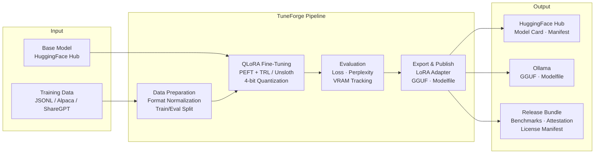
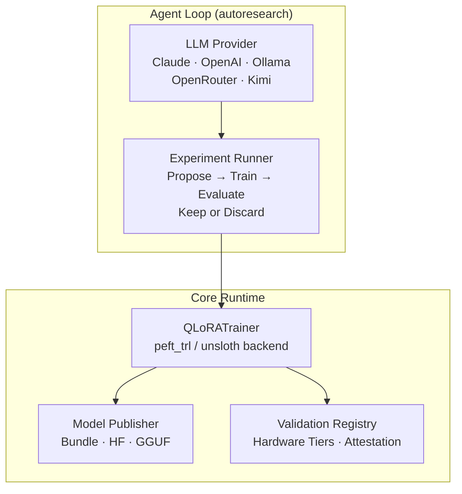

<!--
Title: TuneForge - Benchmark-first Fine-tuning Framework
Version: 1.0.0
Language: EN
Audience: Users, Developers
Last Sync: 2026-04-10
Pair: README-DE.md
-->

<div align="center">
  
</div>

<div align="center">

# TuneForge

**Benchmark-first fine-tuning framework for local LLMs on hardware you own.**

[](LICENSE)
[](https://python.org)
[](Dockerfile.finetune)
[](docs/VALIDATION_MATRIX-EN.md)
[](COMPLIANCE_STATEMENT.md)

[German version / Deutsche Version](README-DE.md)

</div>

---

## Table of Contents

- [Overview](#overview)
- [Architecture](#architecture)
- [Features](#features)
- [Quick Start](#quick-start)
- [Configuration](#configuration)
- [Supported Models and GPU Tiers](#supported-models-and-gpu-tiers)
- [Project Structure](#project-structure)
- [CI/CD](#cicd)
- [Compliance](#compliance)
- [Attribution](#attribution)
- [Contributing](#contributing)
- [License](#license)

---

## Overview

TuneForge is an open-source, audit-ready engineering framework for QLoRA fine-tuning, benchmarking, and governed model publishing. Built on the foundation of [karpathy/autoresearch](https://github.com/karpathy/autoresearch), it provides a complete pipeline from data preparation through training, evaluation, and export to Hugging Face and Ollama.

Designed for teams that run models on their own hardware — with full provenance tracking, reproducible benchmarks, and EU regulatory awareness built in from the start.

> **Current status: Technical Preview.** Benchmark claims are scoped to documented hardware budgets. This is not legal advice and does not guarantee regulatory compliance.

## Architecture





## Features

- **Dual Backend** — Switch between `transformers + peft + trl` and `unsloth` via config. Same interface, same metrics.
- **Hardware-Tiered Configs** — Pre-tuned configurations for 8 GB, 12 GB, and 24 GB+ GPUs. No guesswork.
- **Autonomous Agent Loop** — Provider-agnostic research loop (Claude, OpenAI, Ollama, OpenRouter) that proposes, trains, and evaluates automatically.
- **Governed Release Bundles** — Every export includes model card, training manifest, benchmark summary, license manifest, environment snapshot, and tester attestation.
- **GGUF + Ollama Export** — Convert adapters to GGUF and generate Modelfiles for local deployment.
- **Audit Trail** — VRAM tracking, reproducible seeds, git SHA provenance, structured logging.
- **Bilingual Documentation** — Full EN/DE documentation, governance templates, and compliance packs.

## Quick Start

### Local Setup

```bash
git clone https://github.com/AI-Engineerings-at/tuneforge.git
cd tuneforge

python -m venv .venv
source .venv/bin/activate        # Linux/macOS
# .venv\Scripts\activate          # Windows

pip install --upgrade pip
pip install -e ".[llm,finetune,dev]"

# Run tests
python -m pytest -q tests
```

### Docker (NVIDIA GPU required)

```bash
# Fine-tuning pipeline
AUTORESEARCH_DOMAIN=sps-plc docker compose -f docker-compose.finetune.yml up --build
```

### Run Fine-Tuning

```bash
# QLoRA training with YAML config
python -m finetune.trainer --config finetune/configs/your-domain.yaml --eval

# Agent loop (autonomous research)
python agent_loop.py --provider ollama --model qwen2.5-coder:7b
```

### Canonical Docker Image

```
ghcr.io/ai-engineerings-at/tuneforge-studio:<semver>
```

Images are built and published by GitHub Actions. Never committed to git.

## Configuration

### Environment Variables

| Variable | Description | Required |
|----------|-------------|----------|
| `ANTHROPIC_API_KEY` | API key for Claude provider | For Claude agent loop |
| `OPENROUTER_API_KEY` | API key for OpenRouter | For OpenRouter agent loop |
| `HF_TOKEN` | Hugging Face access token | For model publishing |
| `AUTORESEARCH_DOMAIN` | Target domain for training | For Docker pipeline |
| `NVIDIA_VISIBLE_DEVICES` | GPU device selection | Docker only |

### QLoRA Training Config (YAML)

| Parameter | Default | Description |
|-----------|---------|-------------|
| `base_model` | `Qwen/Qwen2.5-Coder-7B-Instruct` | HuggingFace model ID |
| `backend` | `peft_trl` | Training backend (`peft_trl` or `unsloth`) |
| `dataset_format` | `alpaca` | Input format (`alpaca`, `sharegpt`, etc.) |
| `bits` | `4` | Quantization bits (4-bit QLoRA) |
| `lora_r` | `16` | LoRA rank |
| `lora_alpha` | `32` | LoRA alpha scaling |
| `learning_rate` | `2e-4` | Training learning rate |
| `max_steps` | `1000` | Maximum training steps |
| `max_seq_length` | `2048` | Maximum sequence length |
| `per_device_train_batch_size` | `4` | Batch size per GPU |
| `gradient_accumulation_steps` | `4` | Gradient accumulation |
| `primary_metric` | `eval_loss` | Metric to optimize |

## Supported Models and GPU Tiers

### GPU Tier Configs

| Tier | VRAM | Dataset | Model Size | Seq Length | Batch Size | Use Case |
|------|------|---------|------------|------------|------------|----------|
| **Tier 1** | 6-8 GB | TinyStories | 384d / 3L | 256 | 16 | Quick experiments, validation |
| **Tier 2** | 10-12 GB | ClimbMix | 512d / 5L | 512 | 32 | Mid-range training |
| **Tier 3** | 16-24 GB | ClimbMix | 768d / 8L | 2048 | 8 | Full training runs |

### QLoRA Base Models

| Model | Parameters | Min VRAM (4-bit) | Status |
|-------|-----------|-----------------|--------|
| Qwen2.5-Coder-7B-Instruct | 7B | ~8 GB | Default |
| Any HuggingFace CausalLM | Varies | Varies | Supported via config |

### Hardware Validation Tiers

| Tier | Hardware | Status |
|------|----------|--------|
| Tier A | RTX 3090 (24 GB) | Validation target |
| Tier B | A100 / H100 / 48 GB+ | Validation target |
| Unassigned | Other GPUs | Technical Preview |

## Project Structure

```
tuneforge/
├── train.py                  # autoresearch training loop
├── agent_loop.py             # Autonomous LLM agent for research
├── agent_config.py           # Agent configuration
├── providers.py              # LLM provider abstraction
├── finetune/
│   ├── trainer.py            # QLoRA training runtime
│   └── model_publisher.py    # Release bundle & HF publishing
├── datasets/
│   ├── data_formats.py       # Format normalization
│   └── synthetic_generator.py # Synthetic data generation
├── configs/                  # GPU tier configurations (JSON)
├── validation/               # Validation registry & runbooks
├── scripts/                  # CI checks & release validation
├── docs/                     # Architecture, SOPs, compliance
├── templates/                # Model card & governance templates
├── docker-compose.finetune.yml
├── Dockerfile.finetune
└── pyproject.toml
```

## CI/CD

GitHub Actions pipelines:

| Workflow | Purpose |
|----------|---------|
| `tuneforge-ci.yml` | Quality gates, repo hygiene, doc parity checks |
| `tuneforge-release.yml` | Docker image build and preview releases |
| `tuneforge-model-publish.yml` | Model bundle packaging and HuggingFace publishing |

Release automation attaches SBOMs, checksums, validation registry snapshots, and release metadata. Secrets are stored in GitHub Secrets or an external vault — never in the repository.

## Compliance

TuneForge is designed with EU regulatory awareness:

- **EU AI Act** — Documentation structure supports Article 11 (Technical Documentation) and Article 13 (Transparency) requirements for engineering review and governance preparation.
- **DSGVO / GDPR** — Training data provenance tracking, no personal data in default pipelines, privacy notes in model cards.
- **Audit Readiness** — Structured logging, reproducible training runs, hardware attestation, and validation registry.

> This is engineering preparation, not legal certification. Consult qualified legal counsel for compliance obligations. See [COMPLIANCE_STATEMENT.md](COMPLIANCE_STATEMENT.md) for details.

## Attribution

Built with and on top of:

- [karpathy/autoresearch](https://github.com/karpathy/autoresearch) — Research loop foundation
- [transformers](https://github.com/huggingface/transformers) — Model loading and tokenization
- [peft](https://github.com/huggingface/peft) — Parameter-efficient fine-tuning
- [trl](https://github.com/huggingface/trl) — SFT training
- [unsloth](https://github.com/unslothai/unsloth) — Optimized training backend
- [llama.cpp](https://github.com/ggerganov/llama.cpp) — GGUF conversion
- [Ollama](https://ollama.com) — Local model deployment

Full attribution: [THIRD_PARTY.md](THIRD_PARTY.md) | [FORK.md](FORK.md) | [docs/CREDITS.md](docs/CREDITS.md)

## Contributing

Contributions are welcome. Please read [CONTRIBUTING.md](CONTRIBUTING.md) before submitting a pull request.

- Security issues: [SECURITY.md](SECURITY.md)
- Support: [SUPPORT.md](SUPPORT.md)
- Changelog: [CHANGELOG.md](CHANGELOG.md)

## License

MIT License. See [LICENSE](LICENSE) for details.

Copyright (c) 2026 AI Engineering
