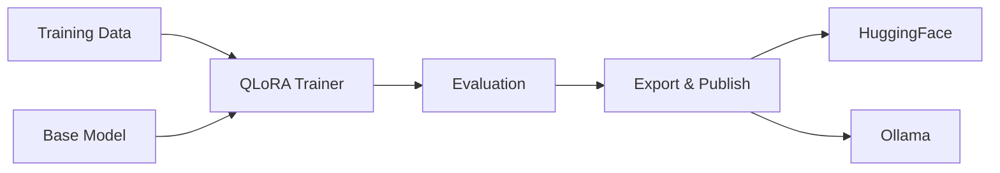

# TuneForge Documentation

**Enterprise-grade fine-tuning framework for local LLMs**

[](https://github.com/AI-Engineerings-at/tuneforge/actions)
[](https://github.com/AI-Engineerings-at/tuneforge)
[](./compliance/validation.md)

## What is TuneForge?

TuneForge is an open-source, audit-ready engineering framework for QLoRA fine-tuning, benchmarking, and governed model publishing.

### Key Features

- **Dual Backend**: Switch between `transformers + peft + trl` and `unsloth`
- **Hardware-Tiered**: Pre-tuned configs for 8GB, 12GB, 24GB+ GPUs
- **EU AI Act Ready**: Built-in compliance documentation
- **Safety-First**: Zeroth-Law gradient-level safety enforcement
- **Validation-First**: No claims without reproducible evidence

## Quick Start

```bash
# Install
pip install tuneforge

# Train
python -m finetune.trainer --config configs/sps-plc.yaml --eval

# Or use Docker
AUTORESEARCH_DOMAIN=sps-plc docker compose -f docker-compose.finetune.yml up
```

## Documentation Sections

### [Getting Started](./setup/installation.md)

- Installation guide
- Quick start tutorial
- Configuration reference

### [User Guide](./guide/training.md)

- Training pipeline
- Evaluation
- Model publishing
- Troubleshooting

### [API Reference](./api/trainer.md)

- Trainer API
- Configuration
- Data utilities
- Model publisher

### [Architecture](./architecture/overview.md)

- System design
- Architecture Decision Records (ADRs)

### [Development](./development/contributing.md)

- Contributing guide
- Testing
- Security

### [Compliance](./compliance/eu-ai-act.md)

- EU AI Act
- Validation requirements

## Architecture Overview



## Validation Status

| Tier | Hardware | Status |
|------|----------|--------|
| Tier A | RTX 3090 (24GB) | ⏳ Pending |
| Tier B | 48GB+ | ⏳ Pending |

See [Validation Matrix](../VALIDATION_MATRIX-EN.md) for details.

## Community

- [GitHub Issues](https://github.com/AI-Engineerings-at/tuneforge/issues)
- [Discussions](https://github.com/AI-Engineerings-at/tuneforge/discussions)
- Email: contact@ai-engineering.at

## License

MIT License - See [LICENSE](../LICENSE)
